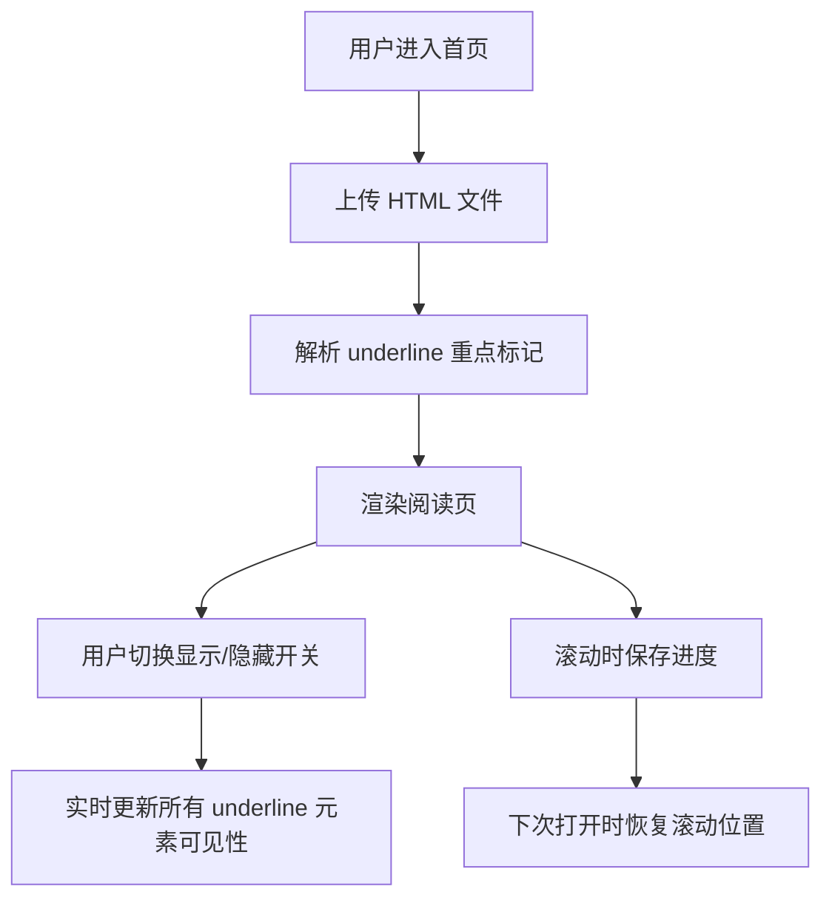

# 产品需求文档（PRD）

## 1. 产品概述

一款专注于辅助记忆的 HTML 文档阅读工具。用户上传自己的 HTML 文档后，系统会自动识别所有 `` 标记的重点内容，并通过全局开关控制这些重点内容的显示/隐藏，帮助用户进行自我检测与记忆强化。同时自动记录阅读进度，下次打开时可直接回到上次离开的位置。

## 2. 核心功能

### 2.1 用户角色

| 角色 | 使用方式 | 核心权限 |
|------|----------|----------|
| 普通用户 | 本地直接使用，无需注册 | 上传 HTML、切换重点显示、阅读、恢复进度 |

### 2.2 功能模块

1. **首页/上传页**：文件上传入口、使用说明、最近阅读记录
2. **阅读页**：HTML 文档渲染区、全局重点显示/隐藏开关、阅读进度保存与恢复、阅读进度条

### 2.3 页面详情

| 页面名称 | 模块名称 | 功能描述 |
|----------|----------|----------|
| 首页 | 文件上传区 | 支持拖拽或点击上传 `.html` / `.htm` 文件，限制文件类型为 HTML |
| 首页 | 最近阅读记录 | 展示本地保存的最近阅读文档列表，点击可快速进入 |
| 阅读页 | 文档渲染区 | 安全渲染用户上传的 HTML 内容，保留原有结构和样式，隔离风险脚本 |
| 阅读页 | 重点控制开关 | 全局切换所有 `` 内容的显示/隐藏，使用直观按钮 |
| 阅读页 | 进度保存 | 监听滚动位置，自动保存到 localStorage，下次打开时恢复 |
| 阅读页 | 进度指示条 | 顶部细条显示当前阅读进度百分比 |

## 3. 核心流程

用户使用流程：

1. 用户进入首页，上传本地 HTML 文件。
2. 系统读取文件内容并解析其中的 `` 元素。
3. 跳转到阅读页，渲染 HTML 内容。
4. 用户可通过顶部工具栏的开关隐藏或显示重点内容。
5. 用户滚动阅读时，系统自动记录当前滚动位置。
6. 下次打开同一文档时，自动恢复到上次离开的位置。

## 4. 用户界面设计

### 4.1 设计风格

- **主色调**：柔和米白背景（#F9F7F2）搭配深墨蓝文字（#1A202C），营造纸质书卷感；强调色使用暖琥珀（#D97706）。
- **按钮样式**：胶囊形开关按钮，带有滑动动效；主按钮使用圆角矩形，带有细腻阴影。
- **字体选择**：正文使用具有人文气息的衬线字体（Noto Serif SC），界面文字使用干净的无衬线字体（思源黑体 / system-ui），标题使用书法感字体提升记忆氛围。
- **布局风格**：顶部固定工具栏 + 居中可滚动文档阅读区，类似电子书阅读器，留白充足，聚焦内容。
- **图标/插画：使用简洁的线性图标，避免过度装饰，保持学术与专注感。

### 4.2 页面设计概述

| 页面名称 | 模块名称 | UI 元素 |
|----------|----------|---------|
| 首页 | 上传区域 | 大尺度虚线边框拖拽区、上传图标、文件类型提示、最近记录卡片 |
| 首页 | 使用说明 | 三步骤图文说明，帮助用户快速理解功能 |
| 阅读页 | 顶部工具栏 | 返回按钮、文档标题、重点显示开关、进度百分比、清空记录按钮 |
| 阅读页 | 文档渲染区 | 居中白色纸张效果容器、保留原文档结构的渲染内容、分页阴影 |
| 阅读页 | 进度条 | 顶部极细进度条，随滚动实时变化 |

### 4.3 响应式设计

- 桌面优先：文档区最大宽度 960px，居中显示。
- 平板/手机自适应：文档区宽度调整为 100%，左右留白减少；工具栏按钮文字在窄屏下隐藏，仅保留图标。
- 触控优化：开关按钮尺寸不小于 44x44px，拖拽上传区域在触屏上支持点击上传。

### 4.4 动效设计

- 页面加载：内容区域使用淡入 + 轻微上移的入场动画，持续 400ms，缓动 ease-out。
- 开关切换：滑块使用 200ms 弹性过渡，重点内容显隐使用 150ms 透明度过渡，避免突兀。
- 滚动进度条：使用 transform scaleX 实现硬件加速，保证滚动时流畅更新。
- 最近记录卡片：hover 时轻微上浮并加深阴影，提供可点击反馈。
