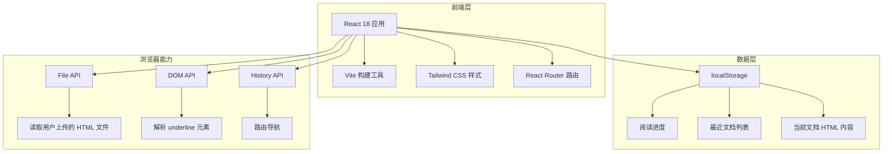

# 技术架构文档

## 1. 架构设计



## 2. 技术描述

- **前端框架**：React@18
- **构建工具**：Vite
- **样式方案**：Tailwind CSS@3
- **路由方案**：React Router DOM@6
- **状态管理**：React Hooks（useState / useEffect / useRef / useCallback）
- **本地存储**：localStorage（用于保存阅读进度与最近文档）
- **后端**：无，纯前端实现
- **数据库**：无

## 3. 路由定义

| 路由 | 用途 |
|------|------|
| `/` | 首页，上传文件与查看最近阅读 |
| `/reader` | 阅读页，渲染文档并提供阅读控制 |

## 4. 核心模块说明

### 4.1 文件上传模块

- 使用 `<input type="file" accept=".html,.htm">` 接收文件。
- 使用 `FileReader.readAsText` 读取文件内容。
- 对文件内容进行基础清理，移除 `<script>` 标签与危险事件属性，降低 XSS 风险。
- 通过 `crypto.randomUUID` 或时间戳生成文档唯一标识，保存到 localStorage。

### 4.2 文档渲染模块

- 使用 `dangerouslySetInnerHTML` 渲染清理后的 HTML 字符串。
- 渲染后通过 `useEffect` 获取 DOM 中所有 `.underline` 元素，统计数量并建立控制引用。
- 对 `<span class="underline">` 元素添加统一的 CSS 类，用于控制显示/隐藏状态。

### 4.3 重点控制模块

- 提供全局开关状态 `showHighlights`。
- 当状态为隐藏时，给所有 `.underline` 元素添加隐藏样式（`opacity: 0; background: transparent;` 等）。
- 当状态为显示时，移除隐藏样式，恢复原始显示。
- 使用 CSS 类切换而非直接修改样式，保证性能和可维护性。

### 4.4 进度记忆模块

- 使用 `IntersectionObserver` 或滚动事件监听当前可见章节/位置。
- 防抖保存当前 `window.scrollY` 或容器滚动位置到 localStorage，键名为 `recite_progress_<docId>`。
- 页面加载时读取保存的滚动位置并平滑滚动恢复。
- 监听 `beforeunload` 事件，在页面关闭前保存进度。

### 4.5 最近记录模块

- 在 localStorage 中维护一个最近文档列表，最多保存 10 条。
- 每条记录包含文档 ID、标题（从 `<title>` 或首段文字推断）、上次阅读时间、保存的滚动进度百分比。

## 5. 数据模型

### 5.1 文档对象

```typescript
interface ReciteDocument {
  id: string;
  title: string;
  content: string;
  createdAt: number;
  updatedAt: number;
}
```

### 5.2 阅读进度对象

```typescript
interface ReadingProgress {
  docId: string;
  scrollY: number;
  progressPercent: number;
  lastReadAt: number;
}
```

### 5.3 最近记录对象

```typescript
interface RecentDocument {
  id: string;
  title: string;
  progressPercent: number;
  lastReadAt: number;
}
```

## 6. 安全策略

- 对用户上传的 HTML 进行严格消毒：移除 `<script>`、`<iframe>`、`<object>`、`<embed>` 等标签。
- 移除所有以 `on` 开头的事件属性（如 `onclick`、`onerror`）。
- 限制 CSS 中的 `position: fixed` 和 `z-index` 过大值，避免覆盖界面。
- 文档渲染在独立的容器内，不影响应用整体路由与状态。

## 7. 性能策略

- 对大文档采用虚拟滚动或懒加载策略（如内容超过 500KB 时提示用户）。
- 重点元素样式切换使用 CSS 类，避免逐个元素设置内联样式。
- localStorage 写入使用防抖，避免滚动时频繁写入。
- 进度恢复使用 `scrollTo({ behavior: 'smooth' })` 提升体验。
