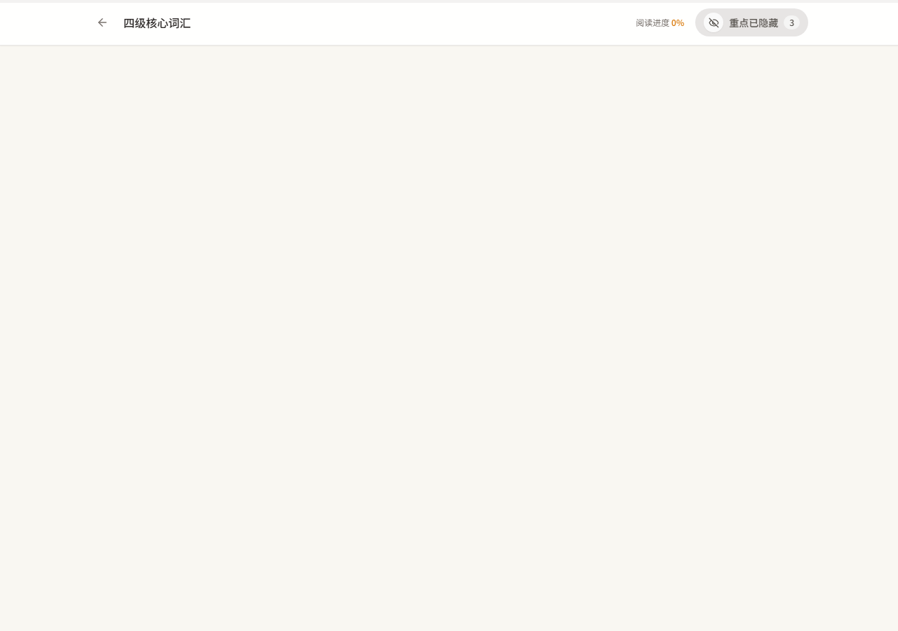
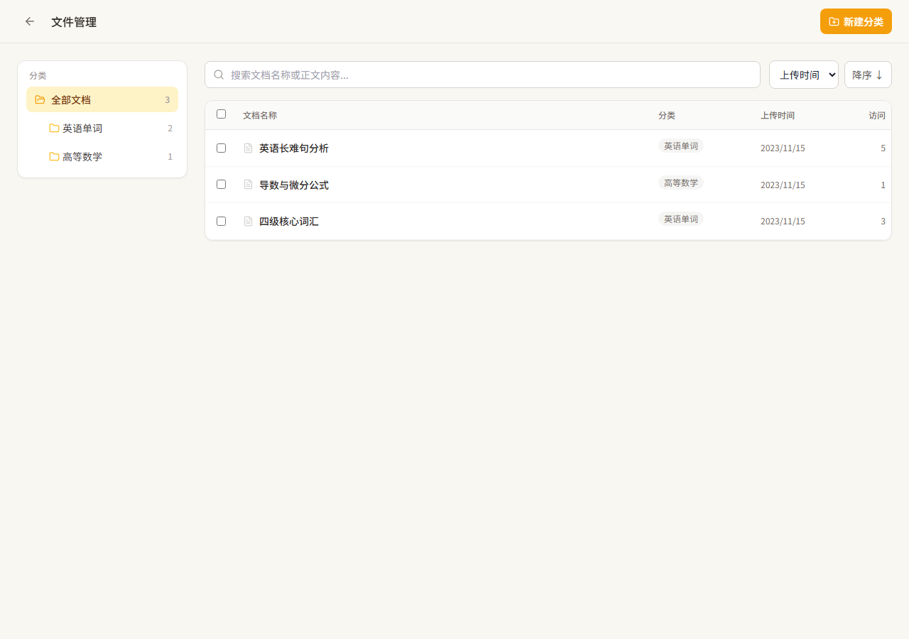
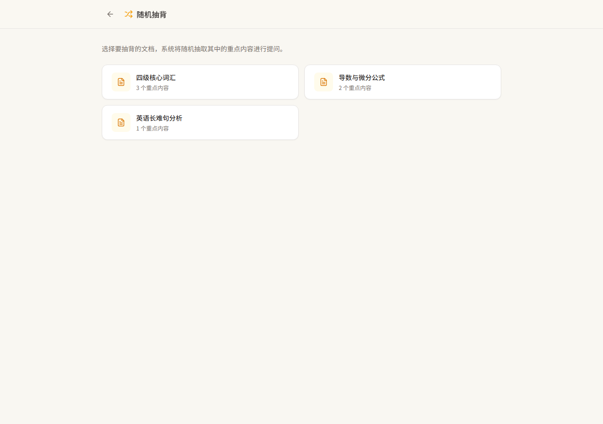

# 忆读 · 用户操作手册

> 上传 HTML 文档，隐藏重点内容，辅助记忆与复习。

本文档介绍「忆读」的完整功能与操作方法，涵盖核心阅读功能、文件管理模块与随机抽背模块。文中截图来自应用实际运行效果。

---

## 目录

1. [功能总览](#一功能总览)
2. [核心阅读功能](#二核心阅读功能)
3. [文件管理模块](#三文件管理模块)
4. [随机抽背模块](#四随机抽背模块)
5. [常见问题解答（FAQ）](#五常见问题解答faq)

---

## 一、功能总览

| 功能模块 | 说明 |
|---------|------|
| 阅读与重点隐藏 | 隐藏文档中 `` 标记的重点内容，支持全局开关与单项点击切换 |
| 进度记忆 | 自动记录阅读位置，下次打开自动跳转 |
| 文件管理 | 对已上传文档进行分类、搜索、排序与批量操作 |
| 随机抽背 | 从文档中随机抽取重点内容进行记忆自测 |

*图 1-1 首页：上传区、「随机抽背」入口与「文件管理」按钮*

### 首页界面元素说明

| 元素 | 位置 | 说明 |
|------|------|------|
| 「忆读」标题 | 顶部居中 | 应用名称 |
| 「文件管理」按钮 | 标题右侧 | 进入文件管理页面 |
| 上传区 | 标题下方 | 点击或拖拽上传 `.html` / `.htm` 文档 |
| 「随机抽背」入口 | 上传区下方 | 进入随机抽背模块 |
| 「最近阅读」列表 | 页面底部 | 最近打开过的文档与阅读进度 |

---

## 二、核心阅读功能

### 2.1 上传并阅读文档

1. 在首页点击上传区（或直接拖拽文件到该区域）。
2. 选择本地 `.html` 或 `.htm` 文件。
3. 上传成功后自动进入阅读页。

> 文档内容会被自动安全过滤（移除脚本、危险标签与内联事件），不会执行文档内任何代码。

### 2.2 重点内容显示 / 隐藏

文档中标记为 `` 的内容即“重点内容”。

- **全局开关**：阅读页右上角的开关控件控制全部重点内容的显示与隐藏。
  - 状态一：`重点已隐藏`（灰色 + 闭眼图标）—— 重点内容显示为横线占位符
  - 状态二：`重点显示中`（琥珀色 + 睁眼图标）—— 重点内容以高亮下划线显示
- **单项切换**：在“隐藏”状态下，**点击任意一条横线占位符**，仅展开该条重点内容；再次点击即可重新隐藏。
- 每次进入文档时，重点内容**默认隐藏**，方便直接开始自我检测。

### 2.3 进度记忆

- 阅读过程中自动记录滚动位置与进度百分比。
- 关闭文档或下次打开时，自动恢复到上次阅读位置。
- 首页「最近阅读」列表会显示每个文档的进度百分比。

*图 2-1 阅读页：顶部为工具栏与进度条，重点内容默认隐藏*

---

## 三、文件管理模块

从首页点击「文件管理」按钮进入。

*图 3-1 文件管理：左侧分类树 + 右侧文档列表*

### 3.1 界面布局

| 区域 | 说明 |
|------|------|
| 顶部工具栏 | 返回按钮、标题、「新建分类」按钮 |
| 左侧分类树 | 展示全部文档与多级分类，点击分类筛选文档 |
| 右侧列表区 | 搜索框、排序控件、文档表格/卡片列表 |
| 底部批量操作栏 | 勾选文档后出现的浮动工具栏 |

### 3.2 分类管理

**新建分类**
1. 点击右上角「新建分类」。
2. 填写名称（必填）、描述（可选）。
3. 可选择上级分类（构建多级结构）与排序号。
4. 点击「保存」。

**编辑分类**
- 鼠标悬停分类节点，点击铅笔图标；修改信息后保存。

**删除分类（含二次确认）**
1. 悬停分类节点，点击垃圾桶图标。
2. 弹窗显示该分类及其子分类下的文档数量，需选择处理方式：
   - **移动到其他分类**：将文档转移到指定分类（或“未分类”）
   - **连同文档一起删除**：永久删除该分类及下属所有文档
3. 点击「确认删除」后生效。

### 3.3 文档筛选与检索

- **按分类筛选**：点击分类树的任意节点，列表只显示该分类（含子分类）下的文档；点击「全部文档」查看所有文档。
- **搜索**：在搜索框输入关键词，支持**标题匹配**与**正文全文检索**（300ms 防抖自动触发）。
- **排序**：支持按名称、上传时间、最近访问、访问次数排序，可切换升序 / 降序。

### 3.4 批量操作

勾选文档后，页面底部出现批量操作栏：

| 操作 | 说明 |
|------|------|
| 移动 | 将选中文档批量移动到指定分类 |
| 打包下载 | 将选中文档打包为 `.zip` 压缩包下载 |
| 删除 | 二次确认后批量删除文档 |

> 文档列表采用分页加载（每页 20 条），点击「加载更多」继续加载。

---

## 四、随机抽背模块

从首页点击「随机抽背」入口进入。

*图 4-1 抽背文档选择：展示每个文档的重点数量*

### 4.1 选择抽背文档

1. 在文档列表中选择要抽背的文档（显示每个文档的重点数量）。
2. 系统将文档中的所有重点内容**随机打乱**后逐题展示。

### 4.2 抽背流程

1. 题目区域显示一条提示，重点内容被隐藏。
2. 先回忆该重点内容，再点击「**显示答案**」查看对照。
3. 根据回忆结果点击「**掌握了**」或「**没掌握**」。
4. 系统自动进入下一题；所有题目作答后展示结果。

### 4.3 抽背结果

- 显示「已掌握」与「未掌握」的题数。
- 可点击「换一篇文档」选择其他文档，或「重新抽背」再来一轮。

> 抽背关键路径仅需 3 步：选择文档 → 回忆并显示答案 → 标记掌握与否。

---

## 五、常见问题解答（FAQ）

**Q1：为什么文档打开后重点内容是隐藏的？**
进入文档默认隐藏重点，便于直接自测。点击右上角开关或点击横线占位符即可显示。

**Q2：文档中的横线是什么？**
横线是隐藏状态下的重点内容占位符，点击即可单独展开该条内容。

**Q3：阅读进度存在哪里？**
保存在本机浏览器 / 应用本地存储中，无需联网。卸载应用或清除浏览器数据会丢失进度。

**Q4：支持哪些文件格式？**
支持 `.html` 与 `.htm`。其他格式（如 PDF、Word）暂不支持。

**Q5：文档里的脚本会被执行吗？**
不会。所有文档在上传时都会经过安全过滤，脚本、危险标签与内联事件会被移除。

**Q6：删除分类时文档会怎样？**
删除分类时需选择处理方式：移动到其他分类，或连同文档一并删除。

**Q7：搜索能搜到文档正文吗？**
可以。搜索同时匹配文档标题与正文全文内容。

**Q8：随机抽背为什么只显示部分重点？**
抽背按随机顺序逐题展示，重复出现的内容已自动去重，避免重复出题。

**Q9：如何打包下载多个文档？**
在文件管理页勾选多个文档，点击底部「打包下载」即可得到 `.zip` 压缩包。

---

*文档版本：v1.0 · 更新日期：2026-08*
